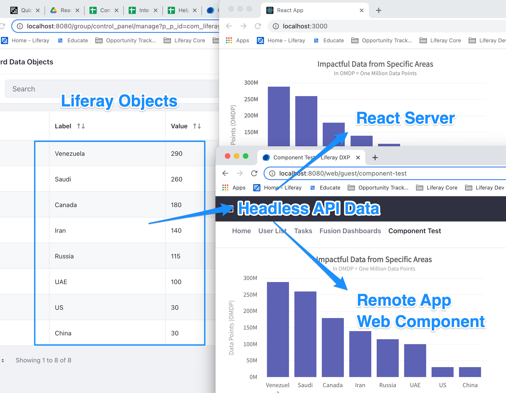
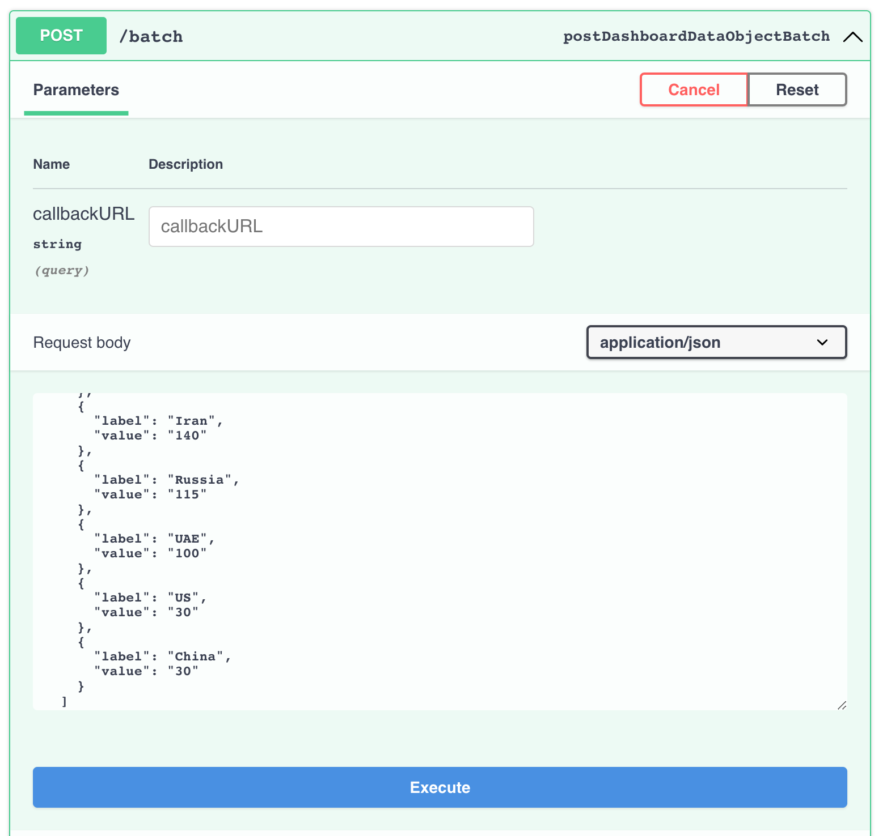
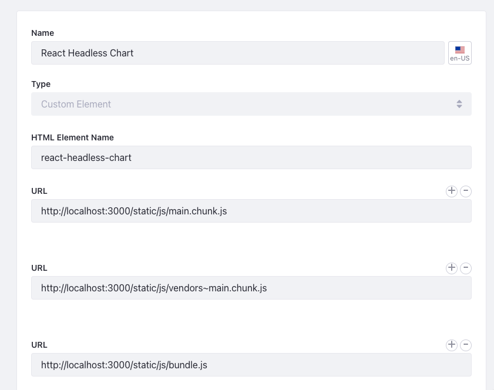

# React Chart using data from Liferay Objects (7.4)
Example of populating data into a React Chart ([FusionCharts](https://www.fusioncharts.com/dev/getting-started/react/your-first-chart-using-react)) from a API that was created through Liferay Objects (7.4).

### Expected Use
This resource can be used as a 7.4 Remote App (iFrame or Custom Element) or a separate React App hosted elsewhere.



## Live Data Refresh!

Chart is set to refresh it's data via API on a 5-second interval. Change the data using the UI or headless API endpoints to get an instant update!


## Add [Cross-Origin Resource Sharing (CORS)](https://developer.mozilla.org/en-US/docs/Web/HTTP/CORS) policy 

In System Settings > Security Tools > Web Contexts Cross-Origin Resource Sharing (CORS) create a CORS policy. Default values work to allow access Cross-Origin Resource Sharing for this resource.

Default values are: 

| Field                             |  Value                                          |
| :---                              | :---                                            |
| Dynamic Web Context OSGi filter   | (&(!(liferay.cors=false))(osgi.jaxrs.name=\*))  |
| URL Pattern                       | \*                                              |
| CORS Response Headers             | Access-Control-Allow-Credentials: true          |
| CORS Response Headers             | Access-Control-Allow-Headers: \*                |
| CORS Response Headers             | Access-Control-Allow-Methods: \*                |
| CORS Response Headers             | Access-Control-Allow-Origin: \*                 |

This provides a very broad rule. A more restricted policy is recommended for production use.

## Create Dashboard Data Object

1. Create Object named:

    * Label: "Dashboard Data Object"
    * Pural Label: "Dashboard Data Objects"
    * Name: "DashboardDataObject"

2. Object Needs the Fields

    | Field  |  Type     | Required  |
    | :---   |   :----:  |  :----:   |
    | Label  | String    | Yes       |
    | Value  | Integer   | Yes       |

3. Leave the object configuration in Company Scope (default).

4. Return to the Details tab and publish your new object.

## Add Data

1. Using the newly created API enpoint for dashboarddataobjects, find the /batch post endpoint

    Example: http://localhost:8080/o/api/?endpoint=http://localhost:8080/o/c/dashboarddataobjects/openapi.json



2. Add the following data and press execute. This will add the number of records shown below.
    * *Note: Feel free to use your own labels and values.*

```
[
    {
      "label": "Venezuela",
      "value": "290"
    },
    {
      "label": "Saudi",
      "value": "260"
    },
    {
      "label": "Canada",
      "value": "180"
    },
    {
      "label": "Iran",
      "value": "140"
    },
    {
      "label": "Russia",
      "value": "115"
    },
    {
      "label": "UAE",
      "value": "100"
    },
    {
      "label": "US",
      "value": "30"
    },
    {
      "label": "China",
      "value": "30"
    }
  ]
  ```

## Clone Repo and Install Packages
Clone repo and once ready run the following:

yarn install

## Start local server
yarn start


# Display Method Options

So many ways to use Remote Apps!! *Yey!*

## Display Method A - Use as separate React App
  
1. Using 'yarn start' start the server. It should hit Liferay's headless API using Basic Authentication (test@liferay.com:test over port 8080)
 
2. Once the server is running, you should be able to see the application running on it's own server at http://localhost:3000/ or similar. 
 
## Display Method B - Remote App's iFrame 
  
1. Once the server is running (se previous step), you should be able to see the application running on it's own server at http://localhost:3000/ or similar. 
    
2. Then, navigate to Remote Apps within Liferay's control panel.
    
3. Create a new Remote App with the following field details:

| Field    | Value                   |
| :---     | :---                    |
| Name     | React Bar Chart         |
| Type     | iFrame                  |
| URL      | http://localhost:3000/  |
    
Save, then this application will be available in your widgets list.

## Display Method C - Remote App's Custom Element
### Option 1, Javascript Resources Hosted on Remote Server
  
   *NOTE: These JS files are currently being hosted by the React dev server. This is great to point to these files for development because any changes you make to your code will show as soon as you refresh your page in Liferay. When not developing it will be better to run yarn run build and update the URL's with the JS files in your build directory (Options 2 & 3).*  
  
1. Within your React App, run your server using 'yarn start'
    
2. Once your server is started, your Javascript resources will be available accross the network. 

3. Then, navigate to Remote Apps within Liferay's control panel.
    
4. Create a new Remote App with the following field details.
    * *Note 1: Use the (+) icon for adding additional URL values.* 

| Field             |  Value                                                                   |
| :---              | :---                                                                     |
| Name              | React Bar Chart                                                          |
| Type              | Custom Element                                                           |
| HTML Element Name | react-headless-chart                                                     |
| URL 1             | http://localhost:3000/static/js/main.chunk.js                            |
| URL 2 (+)         | http://localhost:3000/static/js/vendors~main.chunk.js                    |
| URL 3 (+)         | http://localhost:3000/static/js/bundle.js                                |
 
Save, then this application will be available in your widgets list.
 

  
## Display Method C - Remote App's Custom Element
### Option 2, Resources Hosted in Tomcat Webapps

   *NOTE: Choose this method when you are working on a live server that you have control over (such as DXPC), but you do not have access to run a separate live react server.*
  
1. Within your React App, run a build using 'yarn run build'
    
2. The resulting files will be seen within your react project within a folder named /build/
  
3. Note the files packages in the build log, they should appear similar to this:
    
```
File sizes after gzip:

509.77 KB (-133 B)  build/static/js/2.f86fd244.chunk.js
1.39 KB (+1 B)      build/static/js/main.c7b9ace8.chunk.js
787 B               build/static/js/runtime-main.1ad6e658.js
132 B               build/static/css/main.26c647c1.chunk.css
```

4. Place the build folder within your Liferay webapps/ folder and rename the build folder react-bar-chart/ or similar.

5. Then, navigate to Remote Apps within Liferay's control panel.
    
6. Create a new Remote App with the following field details. 
    * *Note 1: Reference the build names from step 3.*
    * *Note 2: Use the (+) icon for adding additional URL values.* 
    * *Note 3: The build file names change with every build. Remember to keep them up to date when future builds are made.* 

| Field             |  Value                                                                   |
| :---              | :---                                                                     |
| Name              | React Bar Chart                                                          |
| Type              | Custom Element                                                           |
| HTML Element Name | react-headless-chart                                                     |
| URL 1             | http://localhost:8080/react-bar-chart/static/js/2.f86fd244.chunk.js      |
| URL 2 (+)         | http://localhost:8080/react-bar-chart/static/js/main.c7b9ace8.chunk.js   |
| URL 3 (+)         | http://localhost:8080/react-bar-chart/static/js/runtime-main.1ad6e658.js |
| CSS               | http://localhost:8080/react-bar-chart/static/css/main.26c647c1.chunk.css |
 
Save, then this application will be available in your widgets list.
 


## Display Method C - Remote App's Custom Element
### Option 3, Javascript Resources Added to Document Library

   *NOTE: Choose this method when you are working on a live server that you DO NOT have file system control over (LOL/SaaS/Site or Portal Administrator) and you do not have access to run a separate live react server.* 

Similar to Option 2, however once the files are created they are added to the Liferay Document Library (or any public online resource - Google Drive, etc) and hosted using Resource URLs. 
